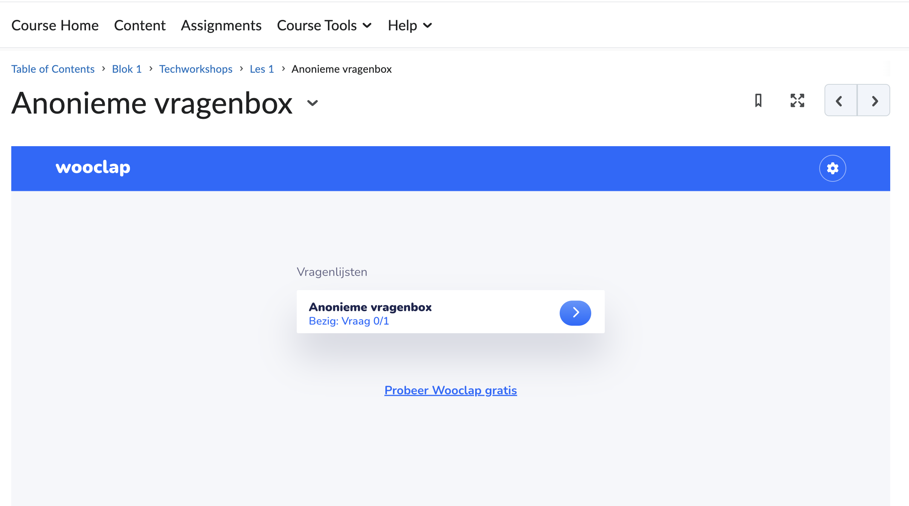
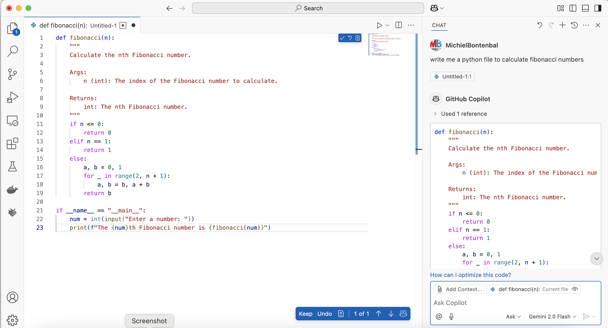
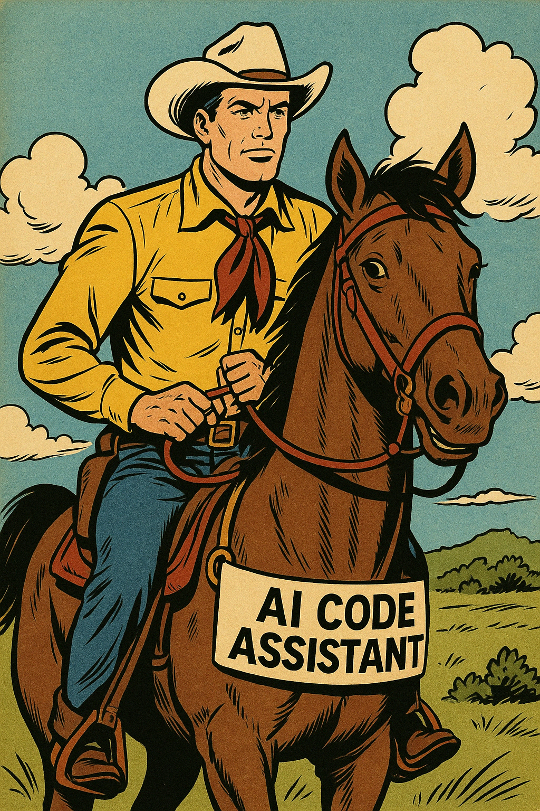
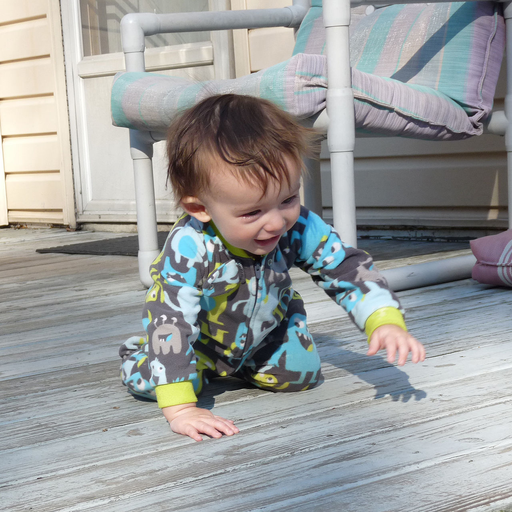
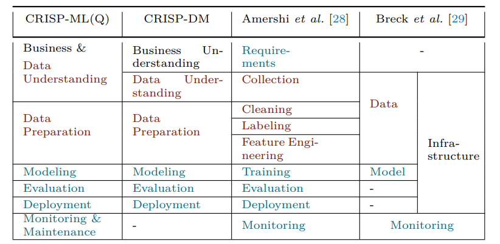
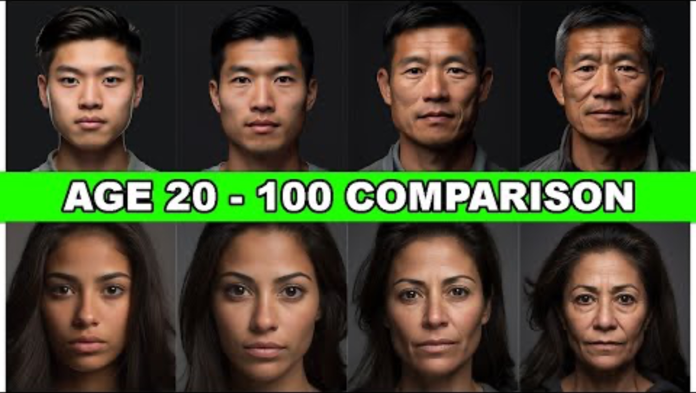

## Master AAI Expert Workshops — Session 1

Michiel Bontenbal, MSc · Rick van Kersbergen, MSc

---

## Agenda

*(SmartArt diagram — see original slides)*

---

## Introduction Tech Workshop Curriculum

---

## Curriculum Overview

| No. | Date | Lecturer | Subjects |
|-----|------|----------|---------|
| 1 | Thu Sep | Rick + Michiel | AI assisted coding, Data exploration, Faces |
| 2 | Thu Sep | Michiel | Object Detection, Video, CNN advanced |
| 3 | Thu Sep | Rick | Evaluations, Build an app |
| 4 | Thu Sep | Michiel | Embeddings (SSL, CLIP, Search) & prep tech reviews |
| 5 | Thu Oct | Rick + Michiel | Tech reviews |
| 6 | Thu Oct | Rick | ML Ops + topics based on student questions |
| 7 | Thu Oct | Michiel | Vision Language Models (VLMs) + topics based on student questions |

---

## Vragenbox op DLO

---

## Techreview

Assessment on the technical aspect of your project up till that point. Outcomes A2, B1, B2, B3, C2

**You hand in on the DLO:**
- Relevant part of your project report (see study guide)
- Link to your up-to-date Git repo (make it navigable)

See it as a feedback moment on your progress, not as a test.

---

## Usage of Generative AI

**AI Assessment Scale Level 3:** AI mag gebruikt worden ter ondersteuning bij specifieke taken. Je wordt altijd verplicht om AI-gegenereerde content kritisch te evalueren en indien nodig aan te passen (Zie Techworkshop DLO).

Verantwoording van keuzes in eigen woorden om begrip aan te kunnen tonen — Gen AI niet toegestaan voor schrijven uiteindelijke uitleg in rapport.

---

<!-- layout: section-break -->

# AI Assisted Coding

---

## AI Assisted Coding in VS Code

*Try a different model!*

---

## Do you get the right response? 'Alignment'

**Intro to Alignment:** [aligned.substack.com](https://aligned.substack.com/p/what-is-alignment) — blog by Jan Leike

---

## Tips for Better Prompting

<!-- columns: 50/50 -->

**Write a better prompt**
- Think before you prompt
- Try different prompts
- For beginners: add "write simple code..."

|||

**Understand the response**
- Be aware of mistakes
- Ask "Explain this code to me"
- Decide if you want to use the code or try again

---

## Human–AI Pair Programming

Work together with the AI — your new best buddy!

The AI can make mistakes, you have to guide it. Do not give up.

---

## Active Learning is Better!

Writing code is more effective than reading code. Why?

- You remember it better
- You are more critical
- You are more engaged

---

## First Learn to Walk Before You Learn to Run

---

## To Do / Exercises

<!-- columns: 50/50 -->

**Beginners**
- Set up Copilot in VS Code
- Write code to calculate Fibonacci numbers

|||

**Experienced**
- Compare: Claude.ai vs Copilot
- Try uploading an image to generate code
- Create a front-end app with HTML/JS/CSS (multiple files)

---

<!-- layout: section-break -->

# Data Exploration and Initial Analysis

---

## The Life-Cycle of MLOps: CRISP-ML(Q)

---

## Choosing a Dataset

- Always first concern yourself with **Data Provenance**
  - Source, collection process — might any of these be biased?
- Then check **Data Description**
  - Size, contents, label quality
- **Where to find data?**
  - Similar research, Kaggle, Hugging Face

---

## Initial Exploration and Visualisation

- Visualisation is an integral part of the data exploration phase
- First look at different distributions: feature distributions, bivariate/multivariate exploration
- Use histograms, boxplots, scatterplots, etc.

**Also check technical details:**
- Target leaking
- Image quality (resolution, brightness, cropping)
- Label noise (incorrect ages, approximations)

*Ask yourself: what makes this data predictive?*

---

## Data Bias When Using People

- Algorithms do not care about your data at all
- They just want to "win" by solving your problem
- Winning = minimising your chosen loss function
- By finding any pattern that might contribute to this
- **Representation is therefore unimaginably important**

---

## Feature Engineering

**When you know your data, you can start engineering:**

- Face alignment / Cropping
- Grayscaling
- Over- and Undersampling of classes
- Normalisation of the data
- Regression vs Classification framing

*Don't just ask yourself what — but more importantly why.*

---

## Other Important Subjects

- Data leakage / test data invalidation
- Data splitting strategies (random, stratified, etc.)
- Think already about evaluation metrics (MAE, RMSE, Fairness metrics)
- Reproducibility of your workflow
- The iterative nature of it (learning outcome B4)

---

## Practicum ~45 min

Make groups of four students. Perform data analysis on the **UTKFace dataset** (see notebook on DLO).

**Questions to answer:**
- **Distribution:** What distributions should be checked? Balanced or skewed?
- **Quality:** Any errors, anomalies, missing data, unrealistic images?
- **Bias:** What kind of biases are present? How would you fix them?
- **Image inspection:** Lighting, angles, cropping, etc.

*In the end we recap: surprises? concerns? take-aways for the project?*

---

<!-- layout: section-break -->

# Faces

---

## Faces — Time Lapse

---

## Python Packages for Faces

| No | Name | Description | Link |
|----|------|-------------|------|
| 1 | MTCNN | CNN model for face detection | pypi.org/project/mtcnn |
| 2 | Deepface | CNN model for age estimation | pypi.org/project/deepface |
| 3 | face-recognition | Face recognition library | pypi.org/project/face-recognition |

---

## Exercise Notebooks

- `Gezichtsdetectie_with_cnn.ipynb`
- `Age_estimation_Deepface.ipynb`
